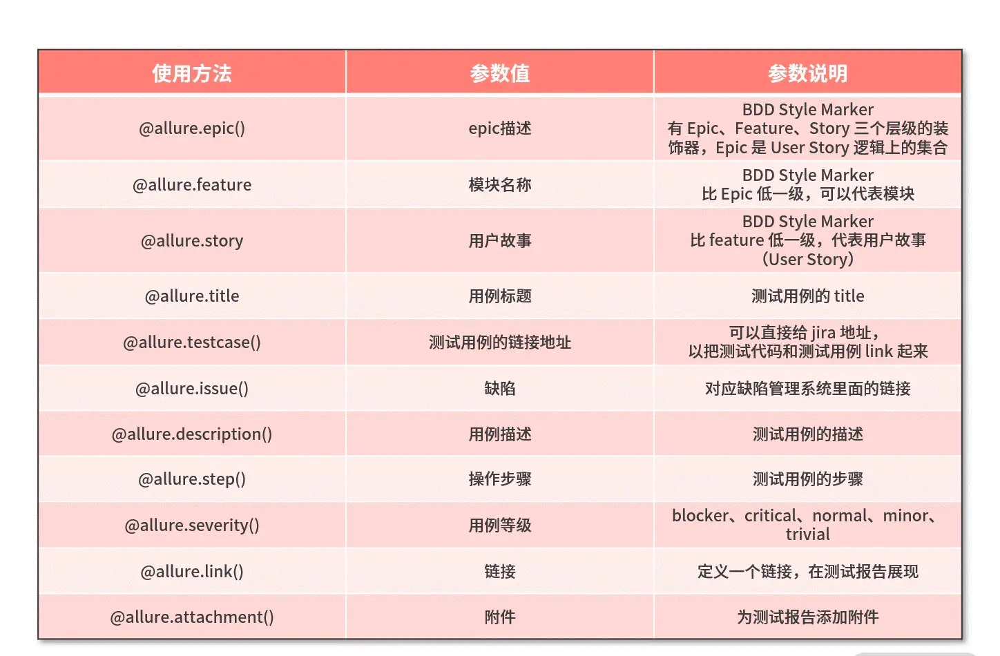

# 项目名称：pytest_auto_unitest_apitest

## 一、项目及框架的搭建:

1.工具：

- python下载地址: https://www.python.org/download
- pycharm下载地址: https://www.jetbrains.com/pycharm
- jdk下载地址: https://repo.huaweicloud.com/java/jdk/
- allure(需要安装jdK)下载地址: https://repo.maven.apache.org/maven2/io/qameta/allure/allure-commandline/

2.搭建步骤

- 2.1创建虚拟环境：
    - python -m venv venv
    - cd venv/Scripts/activate.bat

    - 回车激活环境
- 2.2pip更换源：
    - pip install pqi 安装一次就够了
    - pqi ls
    - pqi use aliyun 更换阿里云源

- 2.3安装项目依赖包
    - pip install -r requirements.txt

## 二.工程目录：


```text.
\PYTEST_AUTO_UITEST_APITEST # 项目名称
├─basepage      # ui自动化基础类封装目录 
├─bat           # bat文件目录，存放bat脚本
├─case          # 测试用例存放目录
│  ├─api        # 接口测试用例目录
│  │  ├─excel_data      # excel样式测试用例（已excel为后续主要扩展方向）
│  │  ├─sql_data        # sql眼熟测试用例
│  │  └─yaml_data       # sql样式得测试用例
│  ├─prf                # 性能自动化用例目录
│  └─ui                 # ui自动化用例存放地址
├─common        # 全局公共模块
├─config        # 配置文件
├─data          # 测试用例需要得测试文件，比如上传得文件、图片等待，放在次目录
├─driver        # ui自动化浏览器驱动存放目录
├─logs          # 日志存放目录
│  ├─api_logs       # 接口日志
│  ├─prf_logs       # 性能日志
│  └─ui_logs        # ui日志
├─pages             # ui自动化存放page所有功能封装类
├─performance       # 性能测试入口
├─report        # 测试报告
│  ├─api_report     # 接口报告
│  │  ├─allure_report
│  │  ├─allure_result
│  │  └─zip         # 压缩文件目录
│  ├─performance_report     # 性能报告
│  └─ui_report      # ui报告
├─testCase      # 测试用例目录
│  ├─api        # 接口测试用例目录
│  └─ui         # ui测试用例目录
├─tools         # 工具类目录
├─venv          # 虚拟环境目录（每个人自己创建）
├─框架说明         # 功能框架详情说明 
└─流程图           # 工程执行流程说明
```

## 三.常用命令

- 3.1.安装打包库
    - pip install pipreqs

- 3.2.自动生成requirements.txt
    - 进入项目的根目录下，执行：
    - pipreqs ./
    - 如果出现编码错误，可以指定编码方式解决该问题。
    - pipreqs ./ --encoding utf-8
    - -force替换原来的requirements.txt
    - pipreqs ./ --encoding utf-8 --force

- 3.3.pip更新所有包：
    - 查看可更新包：
    - pip list --outdated --format=columns
    - 批量下载并更新：
    - pip install pip-review
    - pip-review --local --interactive

- 3.4.pytest常用命令
    - Pytest -v == pytest --verbose 显示运行的详情信息
    - pytest -k 指定案例运行，需要使用双引号引起来
    - pytest -m 运行被标记过的案例
    - pytest -x 遇到第一个失败的案例，则停止继续运行
    - pytest --maxfail=num 指定运行多少个失败的案例，才停止运行
    - pytest --lf == pytest --last-failed 运行失败的案例，成功的不运行，其它文件也去执行
    - pytest --ff == pytest --failed-first 运行到第一个失败的案例且继续运行
    - pytest --durations=0 收集所有案例的执行过程中的耗时
    - pytest --tb=style(no,long,short,line,native)
    - pytest -q == pytest --quiet 简要输出信息
    - pytest -s == pytest --capture=no 关闭输出捕获
    - pytest --collect-only 收集可执行案例

- 3.5 python终端查看目前环境所安装的所有依赖包的对应版本
    - pip freeze

## allure使用说明

- allure设置


- allure用例描述


- allure使用方法



- allure详细用法


