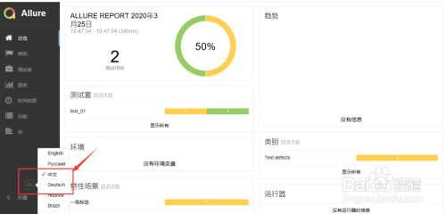
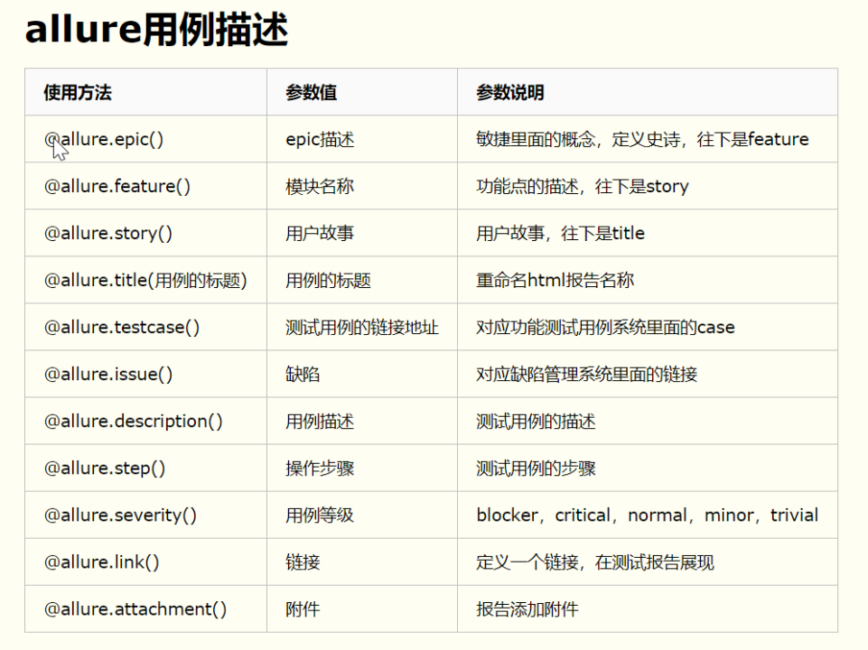
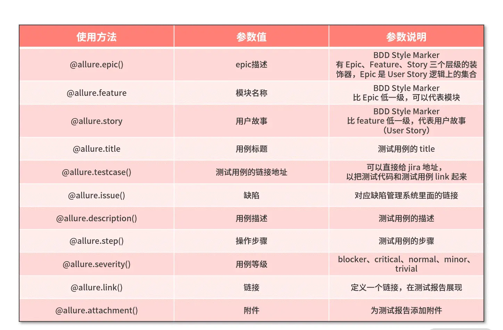
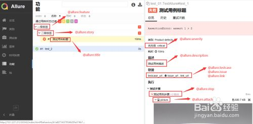

# 项目名称：pytest_auto_unitest_apitest

## 一、项目及框架的搭建

1.工具：

- python下载地址: <https://www.python.org/download>

- pycharm下载地址: <https://www.jetbrains.com/pycharm>

- jdk下载地址: <https://repo.huaweicloud.com/java/jdk/>

- allure(需要安装jdK)下载地址: <https://repo.maven.apache.org/maven2/io/qameta/allure/allure-commandline/>

2.搭建步骤

- 2.1拉取代码
  
  - git clone <http://gitlab.e-tudou.com/tudou-autotest-project/auto_test.git>
  
  - 查看本地和远程所有分支 git branch -a
  
  - 切换分支 git checkout [branch-name]

- 2.2创建虚拟环境：

  - python -m venv venv

  - venv/Scripts/activate

  - 回车激活虚拟环境

- 2.3pip更换源：
  
  - pip install pqi 安装一次就够了
  
  - pqi ls

  - pqi use aliyun 更换阿里云源

- 2.4安装项目依赖包

  - pip install -r requirements.txt

3.git提交规范

- feat:新增feature，新增功能 业务
  
- fix:修复bug
  
- docs:仅仅修改了文档
  
- style：仅仅修改了代码空格 格式 缩进 逗号等，没有改动代码逻辑
  
- refactor：代码重构，没有新功能或修复bug
  
- perf:优化相关，比如提升性能，优化体验
  
- test：测试用例，单元测试，集成测试等
  
- chore：改变构建流程，或增加依赖库，工具等
  
- revert：回滚到上一个版本

## 二.工程目录

```text.
auto_test:   # 项目父目录
├─auto_shell    # 工作中涉及的脚本文件（方便工作中使用）
│  ├─assa   # saas相关的脚本
│  ├─kube   # kube相关的脚本
│  ├─middleDataCenter   # 中台相关的脚本
│  └─添加授权 # kube授权相关的脚本
├─basepage    # ui自动化基础类封装目录 
├─bat    # bat文件目录，存放bat脚本
├─case    # 测试用例存放目录
│  ├─api    # 接口测试用例目录
│  │  ├─excel_data    # excel样式测试用例（已excel为后续主要扩展方向）
│  │  ├─sql_data    # sql相关测试用例
│  │  └─yaml_data   # yaml格式的测试用例
│  ├─prf    # 性能测试用例目录
│  │  └─yaml_data   # yaml格式的测试用例
│  └─ui   # UI测试用例目录
│      ├─excel_data   # excel样式测试用例（已excel为后续主要扩展方向）
│      ├─sql_data   # sql相关测试用例
│      └─yaml_data    # yaml格式的测试用例
├─common    # 全局公共模块
├─config     # 全局配置文件
├─data     # 测试数据依赖文件路径
├─driver    # ui自动化浏览器驱动存放目录
├─logs    # 日志存放目录
│  ├─api_logs   # 接口日志
│  ├─prf_logs   # 性能日志
│  └─ui_logs    # ui日志
├─pages   # ui自动化存放page所有功能封装类
├─report    # 测试报告
│  ├─api_report   # 接口测试报告
│  ├─per_report   # 性能测试报告
│  └─ui_report    # UI测试报告
├─static    # pyqt设计相关模板文件（与整个框架无关）
├─testCase    # 测试用例脚本入口目录
│  ├─api    # 接口测试脚本入口
│  ├─per    # 性能测试脚本入口
│  └─ui   # UI测试脚本入口
├─tools   # 项目依赖工具类封装
├─venv    # 项目虚拟环境
├─api_main.py   # 接口测试入口
├─per_main.py   # 性能测试入口
├─ui_main.py    # UI测试入口
├─pytest.ini    # 全局测试框架配置文件
├─Dockerfile    # docker打包脚本
├─Jenkinsfile   # jenkins构建脚本
├─locust.conf   # 性能测试配置文件
├─README.md   # 项目说明文档
├─备份信息   # 项目相关备份文件（用于复制）
├─框架文件   # 项目readme.md文件依赖照片
└─框架说明    # 项目使用说明书
```

## 三.常用命令

- 3.1.安装打包库
  - pip install pipreqs

- 3.2.自动生成requirements.txt
  - 进入项目的根目录下，执行：
  - pipreqs ./
  - 如果出现编码错误，可以指定编码方式解决该问题。
  - pipreqs ./ --encoding utf-8
  - -force替换原来的requirements.txt
  - pipreqs ./ --encoding utf-8 --force
  - 或者执行 pip freeze > requirements.txt  会自动将项目依赖包注入到requirements文件中

- 3.3.pip更新所有包：
  - 查看可更新包：
  - pip list --outdated --format=columns
  - 批量下载并更新：
  - pip install pip-review
  - pip-review --local --interactive

- 3.4.pytest常用命令
  - Pytest -v == pytest --verbose 显示运行的详情信息
  - pytest -k 指定案例运行，需要使用双引号引起来
  - pytest -m 运行被标记过的案例
  - pytest -x 遇到第一个失败的案例，则停止继续运行
  - pytest --maxfail=num 指定运行多少个失败的案例，才停止运行
  - pytest --lf == pytest --last-failed 运行失败的案例，成功的不运行，其它文件也去执行
  - pytest --ff == pytest --failed-first 运行到第一个失败的案例且继续运行
  - pytest --durations=0 收集所有案例的执行过程中的耗时
  - pytest --tb=style(no,long,short,line,native)
  - pytest -q == pytest --quiet 简要输出信息
  - pytest -s == pytest --capture=no 关闭输出捕获
  - pytest --collect-only 收集可执行案例

- 3.5 python终端查看目前环境所安装的所有依赖包的对应版本
  - pip freeze

## 四.测试报告说明

- allure设置

> 

- allure用例描述

> 

- allure使用方法

> 

- allure详细用法

> 
