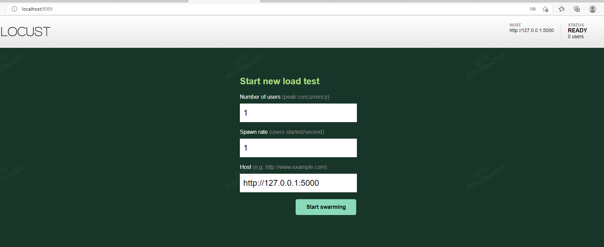
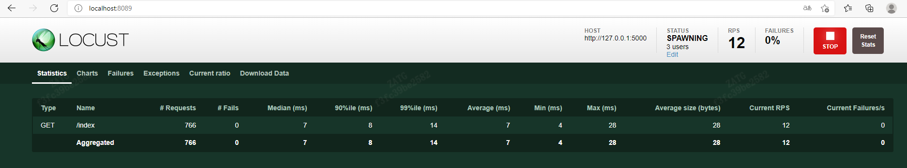
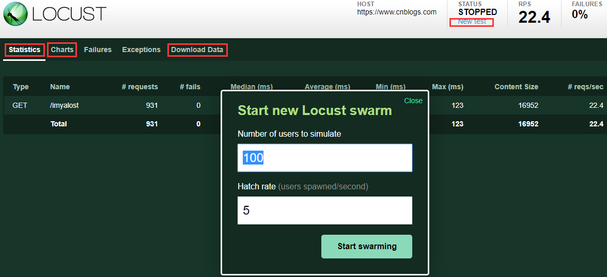

## 性能自动化
1. Locust简述

      > locust架构上使用master-slave模型，支持单机和分布式，master和slave（即worker）使用 ZeroMQ 协议通讯，提供web页面管理master，从而控制slave，同时展示压测过程和汇总结果，可选no-web模式（headless 一般用于调试），基于Python本身已经支持跨平台

2. Locust安装方式
   
      > 安装 locust：pip install locust

      > 安装pyzmq：如果打算运行Locust 分布在多个进程/进程，需要安装pyzmq，同样使用pip安装

      > locust命令行参数说明
   
   * -h, --help    查看帮助
   * -H HOST, --host=HOST    指定被测试的主机，采用以格式：http://10.21.32.33
   * -P PORT, --port=PORT, --web-port=PORT    指定 --web-host 的端口，默认是8089
   * -f LOCUSTFILE, --locustfile=LOCUSTFILE    指定运行 Locust 性能测试文件，默认为: locustfile.py
   * -c NUM_CLIENTS, --clients=NUM_CLIENTS    指定并发用户数，作用于 --no-web 模式。
   * -r HATCH_RATE, --hatch-rate=HATCH_RATE    指定每秒启动的用户数，作用于 --no-web 模式。
   * -t RUN_TIME, --run-time=RUN_TIME    设置运行时间, 例如： (300s, 20m, 3h, 1h30m). 作用于 --no-web 模式。
   * -L LOGLEVEL, --loglevel=LOGLEVEL    选择 log 级别（DEBUG/INFO/WARNING/ERROR/CRITICAL）. 默认是 INFO.
   * -l, --list    显示测试类, 配置 -f 参数使用
   * -V, --version    查看当前 Locust 工具的版本.
   * --web-host=WEB_HOST    指定运行 Locust Web 页面的主机，默认为空 ''。
   * --csv=CSVFILEBASE, --csv-base-name=CSVFILEBASE    以CSV格式存储当前请求测试数据。
   * --master    Locust 分布式模式使用，当前节点为 master 节点。
   * --slave    Locust 分布式模式使用，当前节点为 slave 节点。
   * --master-host=MASTER_HOST    分布式模式运行，设置 master 节点的主机或 IP 地址，只在与 --slave 节点一起运行时使用，默认为：127.0.0.1.
   * --master-port=MASTER_PORT    分布式模式运行， 设置 master 节点的端口号，只在与 --slave 节点一起运行时使用，默认为：5557。注意，slave 节点也将连接到这个端口+1 上的 master 节点。
   * --master-bind-host=MASTER_BIND_HOST    Interfaces (hostname, ip) that locust master should bind to. Only used when running with --master. Defaults to * (all available interfaces).
   * --master-bind-port=MASTER_BIND_PORT that locust master should bind to. Only used when running with --master. Defaults to 5557. Note that Locust will also use this port + 1, so by default the master node will bind to 5557 and 5558.
   * --expect-slaves=EXPECT_SLAVES    How many slaves master should expect to connect before starting the test (only when --no-web used).
   * --no-web    no-web 模式运行测试，需要 -c 和 -r 配合使用.
   * --logfile=LOGFILE    日志文件路径。如果没有设置，日志将去 stdout/stderr
   * --print-stats    在控制台中打印数据
   * --only-summary    只打印摘要统计
   * --no-reset-stats    Do not reset statistics once hatching has been completed。
   * --show-task-ratio    打印 locust 测试类的任务执行比例，配合 -f 参数使用.
   * --show-task-ratio-json    以 json 格式打印 locust 测试类的任务执行比例，配合 -f 参数使用.
   

3. Locust的代码分为以下模块：

   * User -压测用例：提供了HttpUser压测http协议，用户可以定义事务，断言等，也可以实现特定协议的User

   * Runner -执行器：Locust的核心类，定义了整个框架的执行逻辑，实现了Master、Slave（worker）等执行器
      
   * EventHook  -事件钩子：通过预先定义的事件使得我们可以在这些事件发生时(比如slave上报)做一些额外的操作
      
   * WebU  -提供web界面的操作台和压测过程展示
      
   * Socket  -通信器：提供了分布式模式下master和slave的交互方式
      
   * RequestStats  -采集、分析器：定义了结果分析和数据上报格式


4. Locust主要由下面的几个库构成：

   * gevent: gevent是一种基于协程的Python网络库，它用到Greenlet提供的，封装了libevent事件循环的高层同步API。

   * flask: Python编写的轻量级Web应用框架。

   * requests: Python Http库

   * msgpack-python: MessagePack是一种快速、紧凑的二进制序列化格式，适用于类似JSON的数据格式。msgpack-python主要提供MessagePack数据序列化及反序列化的方法。

   * six: Python2和3兼容库，用来封装Python2和Python3之间的差异性

   * pyzmq: pyzmq是zeromq(一种通信队列)的Python绑定,主要用来实现Locust的分布式模式运行


5. Locust核心类

   * 用户定义的User类作为Runner的user_classes传入
   * TaskSet和User持有client，可以在类中直接发起客户端请求，client可以自己实现，Locust只实现了HttpUser
   * master的client_listener监听施压端client消息
   * slave的worker方法监听master消息
   * slave的stats_reporter方法上报压测数据，默认3s上报一次
   * slave的start启动协程，使用master分配的并发数开始压测
   * slave默认1s上报一次心跳，如果master超过3s未收到某个slave的心跳则会将其标记为missing状态
   * 主要结构介绍完了，接下来看下具体的类和对应的方法


6. 用户行为User task TaskSet
   
    client属性:

    在Locust类中，静态字段client即客户端的请求方法，这里的client字段没有绑定客户端请求方法，因此在使用Locust时，需要先继承Locust类class HttpLocust(HttpUser)，然后在self.client =HttpSession(base_url=self.host)绑定客户端请求方法。

对于常见的HTTP(s)协议，Locust已经实现了HttpLocust类，其self.client=HttpSession(base_url=self.host)，而HttpSession继承自requests.Session。 在测试HTTP(s)的Locust脚本中，可以通过client属性来使用Python requests库的所有方法，调用方式与reqeusts完全一致。

由于requests.Session的使用，client的方法调用之间就自动具有了状态记忆功能。 常见的场景就是，在登录系统后可以维持登录状态的Session，从而后续HTTP请求操作都能带上登录状态。

    其他属性:
    
        ask_set
        指向一个TaskSet类，TaskSet类定义了用户的任务信息，该静态字段为必填。
    
        max_wait/min_wait
        每个用户执行两个任务间隔的上下限（毫秒），具体数值在上下限中随机取值，若不指定则默认间隔时间为1秒。
        
        host
        被测试系统的host，当在终端中启动locust时没有指定–host参数时才会用到。
        
        weight
        同时运行多个Locust类时，用于控制不同类型的任务执行权重。
    
    Loucst执行流程
    
        具体流程如下：
            **于许多设置和清除操作是相互依赖的，因此以下是它们的运行顺序：**
            
            Locust setup
            TaskSet setup
            TaskSet on_start
            TaskSet tasks…
            TaskSet on_stop
            TaskSet teardown
            Locust teardown
    
            ①先执行WebsiteTasks中的on_start（只执行一次），作为初始化；
            
            ②从WebsiteTasks中随机挑选（如果定义了任务间的权重关系，那么就按照权重关系随机挑选）一个任务执行；
            
            ③根据Locust类中min_wait和max_wait定义的间隔时间范围（如果TaskSet类中也定义了min_wait或者max_wait，以TaskSet中的优先），在时间范围中随机取一个值，休眠等待；
            
            ④重复2~3步骤，直到测试任务终止。
    
    执行顺序：
        Locust setup → TaskSet setup → TaskSet on_start → TaskSet tasks → TaskSet on_stop → TaskSet teardown → Locust teardown


7. locust优劣势

* 市面上的性能测试工具，主要熟悉的有 JMeter 和Loadrunner这两款，那么，我们要怎么选性能测试工具、市面上又有哪些性能测试工具呢？
    
    >1.如何选择性能测试工具：我们在选择工具的时候，无非从以下几个方面来考虑：
          
       ① 专业，稳定，高效。
       ② 简单易上手，在测试脚本上不需要花费太多时间。
       ③ 有技术支持，文档健全。
       ④ 投入与产出比。

    > 2.常见性能工具有哪些
          
       ① HP公司的 Loadrunner
       ② Apache JMeter
       ③ Grinder
       ④ CompuWare 公司的QALoad
       ⑤ Microsoft 公司的WAS
       ⑥ RadView公司的WebLoad
       ⑦ IBM公司的RPT
       ⑧ OPENSTA等

    > 3.总结性能测试的核心不是选择什么工具，而是性能分析，重要的是思想，实现方式，这与选择什么工具，并无太大关系，
  所以一定要分析主次。
    
1、进程

进程之间不共享任何状态，每个进程都有自己独立的内存空间，进程间通信主要是通过信号传递的方式来实现的(管道、事件)，需要过内核，所以导致通讯效率比较低。由于是独立空间，上下文切换的时候需要保存先调用栈的信息、cpu各寄存器的信息、虚拟内存以及句柄等信息。所以上下文进程切换开销很大

2、线程

线程之间共享变量，但是对于变量的访问需要锁，线程通讯除了可以使用进程之间铜须的方式以外，还可以通过共享内存的方式进行铜须，比通过内核要快很多，调度方面内存也是共享的，所以上下文切换很快，资源开销较少，但相比进程不够稳定容易丢失数据。

3、协程

协程是一种用户态的轻量级线程，协程的调度完全由用户控制。协程拥有自己的寄存器上下文和栈。一个线程可以有多个协程，用户创建了几个线程，然后每个线程都是循环按照指定的任务清单顺序完成不同的任务，当任务被堵塞的时候执行下一个任务，当恢复的时候再回来执行该任务，任务之间切换只需要保存每个任务的上下文内容，协程调度切换时，将寄存器上下文和栈保存到其他地方，在切回来的时候，恢复先前保存的寄存器上下文和栈，直接操作栈则基本没有内核切换的开销，可以不加锁的访问全局变量，所以上下文的切换非常快。


| 工具简单对比  | LoadRunner | Jmeter |   Locust   |
|:--------|:----------:|:------:|:----------:|
| 压力生成器   |     √      |   √    |     √      |
| 负载控制器   |     √      |   √    |     √      |
| 系统资源监控器 |     √      |   x    |     x      |
| 结果采集器   |     √      |   √    |     √      |
| 结果分析器   |     √      |   √    |     √      |
| 授权方式    |    商业收费    |   开源   |     开源     |
| 开发语言    |   C/Java   |  Java  |   python   |
| 测试脚本形式  |   C/Java   |  GUI   |   python   |
| 并发机制    |   线程/进程    |   线程   | 协程（gevent） |
| 单机并发能力  |     低      |   低    |     高      |
| 分布式压力   |     支持     |   支持   |     支持     |
| 资源监控    |     支持     |  不支持   |    不支持     |
| 报告与分析   |     完善     |  简单图表  |    简单图表    |
| 支持二次开发  |    不支持     |   支持   |     支持     |

    
    通过对比，可以看到Locust并不占优，但是，采用Locust原因在于：
    
    首先是模拟用户操作
        ①Locust采用Pure Python脚本描述，并且HTTP请求完全基于Requests库。
        ②Requests这个库非常简洁易用，但功能十分强大，很多其它编程语言的HTTP库都借鉴了它的思想和模式。
        ③除了HTTP(S)协议，Locust也可以测试其它任意协议的系统，只需要采用Python调用对应的库进行请求描述即可。
    
    并发机制
        ①Locust并发机制摈弃了进程和线程，采用协程（gevent）机制。协程避免了系统级资源调度，可以大大提高单机并发能力。
        ②采用多线程来模拟多用户时，线程数会随着并发数的增加而增加，而线程之间的切换是需要占用资源的，IO的阻塞和线程的sleep会不可避免的导致并发效率下降；正因如此，LoadRunner和Jmeter这类采用进程和线程的测试工具，都很难在单机上模拟出较高的并发压力。
        ③而协程和线程的区别在于：协程避免了系统级资源调度，由此大幅提高了性能。
        ④正常情况下，单台普通配置的测试机可以生产数千并发压力，这是LoadRunner和Jmeter都无法实现的。

> Locust 与 Jmeter占用资源比较，Locust之所以在资源占用方面完胜开源的Jmeter， 主要是因为：
>> 两者的模式用户方式不同：
>>> ① Jmeter是通过线程来作为虚拟用户
>> 
>>> ② Locust借助gevent库对协程的支持，以greenlet来实现对用户的模拟你。
>> 
>>> 所以，在相同配置下，Locust能支持的并发用户数相比Jmeter，就不止提升了一个Level。
> 
>> 并发机制不同:
>>> ① Locust的并发机制采用协程（gevent）的机制。
>> 
>>> ② 采用多线程来模拟多用户时，线程数会随着并发数的增加而增加，而线程之间的切换是需要占用资源的，IO的阻塞和线程的sleep会不可避免的导致并发效率下降；正因如此，LoadRunner和Jmeter这类采用进程和线程的测试工具，都很难在单机上模拟出较高的并发压力。
>> 
>>> ③ 而协程和线程的区别在于：协程避免了系统级资源调度，由此大幅提高了性能。
>> 
>>> ④ 正常情况下，单台普通配置的测试机可以生产数千并发压力，这是LoadRunner和Jmeter都无法实现的。


* Runner状态机:
> 在分布式场景下，除了数据一致性，状态同步也是非常重要的。在Locust的master-slave架构下，需要管理master和slave的状态，不仅为了控制压测的开始或停止，也是为了掌握当前的压力机情况。那么都有哪些状态？

| 状态       | 说明                                                                   |
|:---------|:---------------------------------------------------------------------|
| ready    | 准备就绪，master和slave启动后默认状态                                             |
| hatching | 正在孵化压力机，对master来说正在告诉slave们开始干活，对slave来说是过渡状态，因为它们马上要running         |
| running  | 正在压测                                                                 |
| cleanup  | 当发生GreenletExit时的状态，一般不会出现                                           |
| stopping | 表示正在通知slave们停止，只有master有这个状态                                         |
| stopped  | 压测已经停止                                                               |
| missing  | 状态丢失，只有slave有的状态，默认3秒如果master没有收到slave的心跳就会认为它missing了，一般是进程没有正常退出导致 |

 
 

8. 相关术语（压力测试、负载测试及性能（强度、容量、稳定性）测试）


| 压测工具                   | 定义                                                                                                                   | 目标                                                 | 举个例子                                                       |
|:-----------------------|:---------------------------------------------------------------------------------------------------------------------|:---------------------------------------------------|:-----------------------------------------------------------|
| 负载测试（Load Test）        | 负载测试测试软件在一定的工作负荷下给系统造成的负荷及系统响应的时间，即本身最大所能承受的测试方法，可以为性能测试、压力测试所采用。负载测试载重，服务器在多大并发下，会挂掉。对于WEB应用来讲，负载则是并发用户或者HTTP连接的数量  | 目标是确定并确保系统在超出最大预期工作量的情况下仍能正常运行，找到系统处理能力的极限。        | 一个人背X斤，200斤情况下，是否能坚持5分钟。                                   |
| 压力测试（Stress Test）      | 压力测试就是一种破坏性的性能测试，通过逐步增加系统负载，确定在什么负载条件下系统处于失效状态，以此来获得系统能提供的最大服务级别。压力测试强度。                                             | 压力测试是为了发现在什么条件下测试应用程序的性能会变得不可接受。即检查系统处于压力性能下时应用的表现 | 一个人背X斤，200,300,400...斤情况下，他的表现，什么时候失败，失败之后什么表现，重新扛200是否正常。 |
| 性能测试（Performance Test） | 性能测试是为获取或验证系统性能指标而进行测试。多数情况下，性能测试会在不同负载情况下进行。性能测试是动力。操作：“运行负载试验->测度性能->调试系统”                                         | 目的不是去找系统Bugs，而是排除系统的性能瓶颈，确保系统能达到预期值，并为回归测试建立一个基准。  | 一个人背X斤，要求200个人并发背X斤，2min内的响应就是属于性能测试。                      |
| 强度测试（Stress Test）      | 强度测试是一种性能测试，在系统资源特别低的情况下软件系统运行情况，包括 Spike testing：短时间的极端负载测试  Extreme testing：在过量用户下的负载测试 Hammer testing：连续执行所有能做的操作 | 目的是找到系统在哪里失效以及如何失效的地方。                             | 一个人背X斤，                                                    |
| 容量测试(Volume Test)      | 容量测试是一种性能测试，使系统承受超额的数据容量来发现它是否能够正确处理。容量测试通常和数据库有关，容量和负载的区别在于：容量关注的是大容量，而不需要表现实际的使用。                                  | 确定系统可处理同时在线的最大用户数                                  | 一个人背X斤，在坚持5分钟的情况下，他一次最多能扛多少斤。                              |
| 稳定性测试                  | 给系统加载一定业务压力情况下，使系统运行一段时间                                                                                             | 验证是否支持长期稳定的运行                                      | 一个人背X斤，Y个人背X斤，看能坚持多少分钟。                                    |


> 1 负载：
>>模拟业务操作对服务器造成压力的过程，比如2000个用户进行下单操作。

> 2 性能测试(Performance Testing)：
>>模拟用户负载来测试系统在负载情况下，系统的响应时间，吞吐量等指标是否满足性能要求。

> 3 负载测试(Load Testing)
>>在一定软硬件环境下，通过不断加大负载(不同虚拟用户数)来确定在满足性能指标情况下能够承受的最大用户数。
这里性能指标包含：TPS(每秒事务数)，RT(事务平均响应时间)，CPU Using(CPU使用率)，Mem Using(内存使用情况)等软硬件指标。

> 4.配置测试(Configuration Testing)
>>为了合理的调配资源，提高系统运行效率，通过测试手段来获取，验证，调整配置信息的过程。

> 5.压力/强度测试(Stress Testing)
>>在一定软硬件环境下，通过高负载的手段来使服务器的资源(强调的是服务器资源，硬件资源)处于一个极限状态，测试系统在极限状态下长时间运行是否稳定。
>>确定稳定的指标，包含：TPS(每秒事务数)，RT(事务平均响应时间)，CPU Using(CPU使用率)，Mem Using(内存使用情况)等。

> 6.稳定测试(Endurance Testing)
>>在一定软硬件环境下，长时间运行一定负载，确定系统在满足性能指标的前提下是否运行稳定。这里强调一下，稳定性测试并不是在极限状态下来运行的，这与上面第五条的压力/强度测试 是不一样的。
一般我们会在满足性能要求的负载情况下加大到1.5 ~ 2倍的负载量进行测试。

> 7.TPS
>>每秒完成的事务数，通常指每秒成功的事务数，性能测试中重要的综合性能指标。一个事务是一个业务度量单位。
举个例子：
比如支付操作，在后台系统可能会经历会员系统，财务系统，支付系统，会计系统，银行网关等，但是针对用户来说，我就想知道我从下单到付款成功共花费多长时间。

> 8.RT/ART(Response Time/average Response Time)
>>响应时间/平均响应时间，指一个事务花费多长时间完成。我们更多的时候，是统计很多次响应时间，然后去平均值，这样保证了时间的准确性，同时也更具代表性。
通常，我们写RT，来代替ART。

> 9.PV(Page View)
每秒用户访问页面的次数。
>>此参数是用来分析平均每秒有多少用户来访问页面

> 10.Vuser(Virtual user)
>> 虚拟用户数。即模拟真实业务逻辑步骤的虚拟用户，虚拟用户模拟的操作步骤都被记录在虚拟用户脚本里。Vuser脚本用户描述Vuser在场景中执行的操作。

> 11.并发：
并发最主要要有两点：点层面上和线层面上。
>> ①点层面上的：
>>>例如：周一早上7:30半，小学生要统一到操场升国旗。
即：同一时间做某件事
> 
>> ②线层面上的：
例如：中午11:30-13:00，小学生有的跳皮筋，有的踢足球，但同时对服务器产生压力。
>>>即：一个时间段做不同的事
这里不做过多介绍，详细可以看小鱼写的这篇《常见并发问题》，里面有对并发的详细解读。

> 12.场景(Scenario)
>>性能测试过程中为了模拟真实用户的业务处理过程，在LR中构建的基于事务、脚本、虚拟用户、运行设置、运行计划、监控、分析等一系类动作的集合，称之为性能测试场景。
场景中包含：待执行的脚本、脚本组、并发数、负载生成器、测试目标、测试执行时的配置条件等。

> 13.思考时间(Think Time)
>>模拟真实用户在实际操作过程中停顿的时间间隔。
>>从业务角度来讲：思考时间是用户在操作时，每个请求之间的时间间隔；
从测试脚本来讲：是两个请求语句之间的时间间隔。

>14.标准差(Std. Deviation)
>>根据数据统计的概念得来，标准差越小，说明波动越小，系统越稳定，反之，则说明系统不稳定。
包含：响应时间标准差，TPS标准差，Running Vuser标准差，Load标准差，CPU Using标准差等等。

9. 通过标准
* 判断性能测试是否通过，不仅是看TPS，RT，而是要从服务端性能，前端性能，和用户体验性能来分析。
常见的测试通过标准如下：


10. locust.conf配置文件参数说明
    
```ini
locustfile = ./locust_demo.py
host = http://10.0.34.13:10007
users = 50 #并发 Locust 用户的峰值数量。主要与–headless 或–autostart 一起使用。可以在测试期间通过键盘输入 w、W（生成 1、10 个用户）和 s、S（停止 1、10 个用户）来更改
spawn-rate = 10 # 以（每秒用户数）生成用户的速率。主要与 –headless 或 –autostart 一起使用
hatch-rate = 5 ==抑制==
headful = # ==抑制==
headless = true # 禁用 Web 界面，并立即开始测试。使用 -u 和 -t 控制用户数和运行时间
expect-workers = 0 # expect-workers 在开始测试之前，master 应该期望连接多少个worker（仅当使用–headless/autostart 时）。
expect-workers-max-wai = 5s# 主人在放弃之前应该等待工人连接多长时间。默认为永远等待
web-host = "127.0.0.1/" # 将 Web 界面绑定到的主机。默认为“*”（所有接口）
web-port = "8089" #运行 Web 主机的端口
web-auth = # 为 Web 界面打开基本身份验证。应按以下格式提供：用户名：密码
autostart = true  # 立即开始测试（不禁用 Web UI）。使用 -u 和 -t 控制用户数和运行时间
autoquit = 3s # 在运行完成 X 秒后完全退出 Locust。仅与 –autostart 一起使用。默认设置是保持 Locust 运行，直到您使用 CTRL+C 将其关闭
tags =# 要包含在测试中的标签列表，因此只有具有任何匹配标签的任务才会被执行
exclude-tags =# 要从测试中排除的标签列表，因此只会执行没有匹配标签的任务
csv = result_csv  # 以 CSV 格式将当前请求统计信息存储到文件中。设置此选项将生成三个文件：[CSV_PREFIX]_stats.csv、[CSV_PREFIX]_stats_history.csv 和 [CSV_PREFIX]_failures.csv
csv-full-history = result_history# 将每个统计信息条目以 CSV 格式存储到 _stats_history.csv 文件中。您还必须指定“–csv”参数才能启用此功能。
html = result_html # 存储 HTML 报告文件
print-stats =# 在控制台中打印统计信息
only-summary =# 仅打印摘要统计信息
skip-log-setup = false # 禁用 Locust 的日志记录设置。相反，配置由 Locust 测试或 Python 默认值提供。
loglevel = INFO # 在调试/信息/警告/错误/关键之间进行选择。默认为信息。
logfile = logs # 日志文件的路径。如果未设置，日志将转到 stderr
run-time = 15s # 在指定的时间后停止，例如（300s、20m、3h、1h30m 等）。仅与 –headless 或 –autostart 一起使用。默认永远运行。

worker = # 设置 locust 以分布式模式运行，此进程作为 worker
master = true # 设置 locust 以分布式模式运行，此进程作为主进程
master-bind-host = # locust master 应该绑定的接口（主机名、ip）。仅在使用 –master 运行时使用。默认为 *（所有可用接口）。
master-bind-port = # locust master 应该绑定的端口。仅在使用 –master 运行时使用。默认为 5557。
master-host = # 用于分布式负载测试的 locust master 的主机或 IP 地址。仅在使用 –worker 运行时使用。默认为 127.0.0.1。
master-port  = # locust master 使用要连接的端口进行分布式负载测试。仅在使用 –worker 运行时使用。默认为 5557。
reset-stats =# 产卵完成后重置统计信息。在分布式模式下运行时，应在 master 和 worker 上都设置
exit-code-on-error =# 设置当测试结果包含任何失败或错误时使用的进程退出代码
stop-timeout =# 在退出之前等待模拟用户完成任何正在执行的任务的秒数。默认是立即终止。该参数只需要在运行 Locust 分布式时为主进程指定。

tls-cert = # 用于通过 HTTPS 提供服务的 TLS 证书的可选路径
tls-key =# 用于通过 HTTPS 提供服务的 TLS 私钥的可选路径
```

1l. web的页面说明



Number of users to simulate：设置模拟的用户总数

Hatch rate (users spawned/second)：每秒启动的虚拟用户数

Host  被测接口的域名或ip端口地址(带http://)，

Start swarming：执行locust脚本



Type：请求类型，即接口的请求方法；

Name：请求路径；

requests：当前已完成的请求数量；

fails：当前失败的数量；

Median：响应时间的中间值，即50%的响应时间在这个数值范围内，单位为毫秒；

Average：平均响应时间，单位为毫秒；

Min：最小响应时间，单位为毫秒；

Max：最大响应时间，单位为毫秒；

Content Size：所有请求的数据量，单位为字节；

reqs/sec：每秒钟处理请求的数量，即QPS；



New test：点击该按钮可对模拟的总虚拟用户数和每秒启动的虚拟用户数进行编辑；

Statistics：类似于jmeter中Listen的聚合报告；

Charts：测试结果变化趋势的曲线展示图，分别为每秒完成的请求数（RPS）、响应时间、不同时间的虚拟用户数；

Failures：失败请求的展示界面；

Exceptions：异常请求的展示界面；

Download Data：测试数据下载模块， 提供三种类型的CSV格式的下载，分别是：Statistics、responsetime、exceptions；
    
    
    
    
    
    
    
